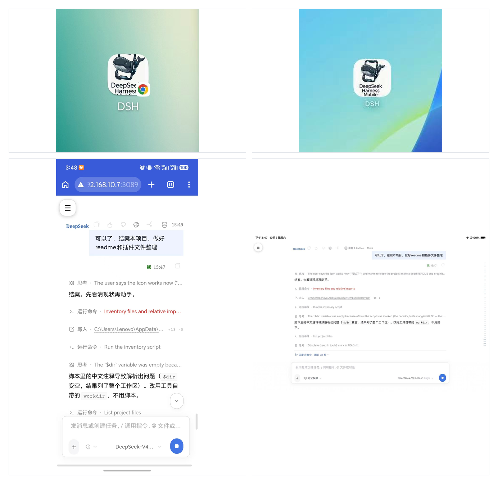

# dsh-lan-gate

> English | [中文](README.md)

**Your desktop DeepSeek Harness, on your phone and iPad too.** Open one URL over the same WiFi and keep going. Nothing to install, and DSH itself still only listens on localhost.



*Top row, the icon after adding it to the home screen. Bottom row, what it looks like in use on a phone and on an iPad.*

> ⚠️ **Use this only on a LAN you trust.** It listens on `0.0.0.0` over plain HTTP with no TLS, and you can stop it any time with `.\lan-gate.ps1 stop`. The full security boundary, including what it does not protect against, is [further down](#security-boundary).

```
phone / iPad ──▶ dsh-lan-gate (local Node, 0.0.0.0:3089) ──▶ DSH Web (127.0.0.1:19387, loopback only)
                    ↑
            unapproved devices see only the 「waiting for approval」 page;
            the approval action can only be clicked on this computer.
```

DSH itself still listens on `127.0.0.1` only and is **never exposed to the LAN**. The gateway is the only entry point.

---

## Table of Contents

- [What problem it solves](#它解决什么问题)
- [Quick start](#快速开始)
- [How a phone / iPad connects](#手机--ipad-怎么连)
- [The gate: approving a new device](#门禁新设备批准)
- [Mobile layout](#手机端排版)
- [Add to Home Screen (PWA)](#加到主屏幕pwa)
- [Debug switches](#调试开关)
- [Configuration](#配置项)
- [File structure](#文件结构)
- [Where data is stored](#数据落盘位置)
- [Testing](#测试)
- [Changing the App icon](#换-app-图标)
- [Troubleshooting](#排障)
- [Security boundary](#安全边界)
- [Known limitations](#已知限制)

---

## What problem it solves

The official CLI **deliberately forbids** `--host 0.0.0.0` — DSH Web's `/api` has no separate authentication layer, so exposing it directly hands control to anyone on the same network segment.

DSH Web itself, however, ships a real authentication scheme (a startup token plus a Host-bound signed Cookie), and that mechanism happens to let a reverse proxy complete authentication on the local machine on behalf of a remote client. That is exactly what this gateway does, layering a **device-approval gate** on top.

**Why not use an off-the-shelf third-party plugin**: `dsh-mobile-gate`, `@linxin666/dsh-remote-web-ui`, `dsh-auth-gate` and others were investigated (recorded in the Mnemon document 《dsh-lan-gate 总档》). The main concerns were desktop profile compatibility and supply-chain risk, and a self-built implementation needs only a single zero-dependency Node script.

---

## Quick start

Requires **Node.js 18+** (it uses built-ins such as `crypto.randomUUID` and `fetch`; measured on Node 24). **Zero third-party dependencies.**

```powershell
# from the dsh-lan-gate directory
.\lan-gate.ps1 start      # start (background)
.\lan-gate.ps1 status     # show status (default action)
.\lan-gate.ps1 stop       # stop
.\lan-gate.ps1 restart    # restart
.\lan-gate.ps1 log        # show the last 30 log lines
```

You can also **double-click `lan-gate.cmd`** (it already carries `-ExecutionPolicy Bypass`, so the script execution policy does not apply).

After starting, `status` prints:

```
Status: running    PID 12345    started at ...
Listen: 0.0.0.0:3089

Addresses:
  this computer : http://127.0.0.1:3089
  phone/iPad    : http://192.168.x.x:3089
  admin console : http://127.0.0.1:3089/__langate/admin

approved devices 2    pending approval 0
  [approved] Android · Chrome  @ 192.168.1.42
  [approved] Mac · Safari  @ 192.168.1.77
```

> ⚠️ **`lan-gate.ps1` must be saved as UTF-8 with BOM.** Windows PowerShell 5.1 reads `.ps1` files as GBK by default, so without a BOM the Chinese text is read as mojibake, producing unterminated strings and causing the script to **hang** (no error, no output). If this file gets stuck after you edit it, check the BOM first.

---

## Auto-start and network guard

The gateway is an ordinary Node process and **does not start automatically by default**. The current setup is: **start automatically 30 seconds after you log in to Windows** (giving DSH time to bind 19387 first), **and only start on the designated network segment**.

### Network guard (important)

On the author's machine **all three firewall profiles are off** (measured). Once the gateway listens on `0.0.0.0:3089`, the port is open to devices on the same network under any network. Combined with auto-start, this produces “take the laptop to a coffee shop and the gateway is still hanging naked on a public network.”

So before `listen`, the gateway checks the local IP:

```
network guard passed: local 192.168.1.23 matches allowed segment [192.168.1.]
```
```
network guard blocked: none of the local IPs [10.0.2.15] is in the allowed segments [192.168.1.]
  this prevents exposing port 3089 on an untrusted network. If you really want to start it, clear the environment variable LAN_GATE_ALLOW_NET.
```

When blocked, **the port is never opened at all** (it is not “listen first, then close” — that would leave a window that can be scanned) and the process exits immediately.

- The default allowed segment is written at the top of `lan-gate.ps1` (default `192.168..`, covering the vast majority of home routers)
- **If you want it stricter, hard-code it to your own segment** (for example `192.168.1.`), so that phone hotspots and other networks that are also `192.168.x` get blocked too
- You can write several segments: `$env:LAN_GATE_ALLOW_NET = '192.168.1.,10.0.0.'`
- **Temporary allow (valid for this run only)**: `$env:LAN_GATE_ALLOW_NET='off'; .\lan-gate.ps1 start`

### How auto-start is configured

A scheduled task named **`dsh-lan-gate`**:

| Item | Value |
|---|---|
| Trigger | at logon (current user), **delayed 30 seconds** |
| Action | `wscript.exe lan-gate-hidden.vbs` |
| Effect | WScript launches `lan-gate.ps1 start` with the **window fully hidden** (otherwise a black window flashes on every logon) |
| Exit code | 0 (normal); also 0 when blocked by the guard, with the reason written to `run.log` |

```powershell
# inspect
Get-ScheduledTask -TaskName 'dsh-lan-gate' | Select-Object TaskName, State
Get-ScheduledTaskInfo -TaskName 'dsh-lan-gate'     # see the last run result

# trigger once manually (to verify without rebooting)
Start-ScheduledTask -TaskName 'dsh-lan-gate'

# disable / restore
Disable-ScheduledTask -TaskName 'dsh-lan-gate'
Enable-ScheduledTask  -TaskName 'dsh-lan-gate'

# remove completely (back to purely manual)
Unregister-ScheduledTask -TaskName 'dsh-lan-gate' -Confirm:$false
```

> **Prerequisite for auto-start**: the gateway is only a proxy, so **the DSH desktop app must also be running** (listening on 19387). If DSH is not up, a phone visit shows 502 — that is not a crash, and it recovers automatically once DSH is up.

---

## How a phone / iPad connects

1. **Make sure it is the same WiFi**: the phone/iPad and the computer must be on the same network; do not use cellular data.
2. **Open a browser**:
   - Android: Chrome
   - iPad/iPhone: **Safari is mandatory** (Chrome on iOS cannot “Add to Home Screen”)
3. **Visit** `http://<computer LAN IP>:3089` (the IP is in the `status` output)
4. The first time you see a “**waiting for computer approval**” page → see the next section
5. After approval it goes straight into DSH, and that device needs no further approval

---

## The gate: approving a new device

On first visit a new device **cannot reach DSH** and only gets a waiting page. The approval action **can only be done on the computer itself**:

1. Open `http://127.0.0.1:3089/__langate/admin` in a browser on the computer
2. Find that device under “**pending approval**” (it shows device name + IP)
3. Click “**Allow**”
4. The phone page jumps into DSH automatically within 1~2 seconds

The admin console also supports “reject”, “revoke”, and “revoke all approved devices”. A revoked device must be approved again.

### Three lines of defense

| Line of defense | Implementation |
|---|---|
| Unapproved devices cannot reach DSH | The gateway intercepts up front and returns only the waiting page; DSH itself is not exposed |
| Approval can only be done on the computer | The admin page and the approval API **accept loopback addresses only**; a phone that guesses the URL still gets 403 |
| Tokens cannot be reused | Device tokens are signed with HMAC using a **separate random key**, bound to device ID and expiry, and can be revoked at any time |

There is also rate limiting of **600 requests per IP per minute**.

> **The local machine itself does not count as a “device”**: the gateway treats “the loopback address + every local NIC address” as itself, passing them straight through without registration.
> Otherwise, when you reach the machine from the machine via its LAN IP (the source IP is not `127.0.0.1`), the gate registers it as a new device in the state file —
> end-to-end test scenario 3 reaches it exactly that way, leaving a fake device behind on every run. This problem is fixed at the gateway layer.

---

## Mobile layout

On narrow screens the gateway injects a set of layout corrections (**the DSH desktop app is unaffected**, because the desktop app never goes through the gateway).

**What it does:**

| Item | Treatment |
|---|---|
| Sidebar | turned into an overlay drawer, collapsed by default; opened/closed by `☰` in the top-left |
| Main content | fills the screen width (the host hard-codes the sidebar width in a CSS Grid track, so the **track** must be changed, not the element width) |
| Session header / conversation·trajectory tabs | hidden |
| QQ2005 skin overlay and toolbar | hidden (they otherwise cover the conversation area) |
| Context percentage ring | hidden |
| Touch targets | buttons at least 40px; the input area is pinned to the bottom and respects the safe area |
| Root container | horizontal overflow disabled |

**Phone vs tablet (an important difference):**

- **Phone**: the rules are wrapped in `@media (max-width: 860px)`.
- **iPad**: iPadOS Safari **disguises itself as a Mac** (there is no `iPad` in the UA), so the server cannot tell; and an iPad is 1024px in portrait and 1366px in landscape, **both above 860**, so a breakpoint can never match it.

  So the gateway **also injects a second, “breakpoint-free” stylesheet** (disabled by default via `media="not all"`), which a client-side script turns on after identifying an iPad by “**more than one touch point and a UA that looks like a Mac**” (a Mac laptop has 0 touch points). **Result: an iPad uses the phone layout in both portrait and landscape.**

---

## Add to Home Screen (PWA)

Over LAN `http://` **browsers do not show the install banner automatically** (that requires HTTPS), but “Add to Home Screen / icon / fullscreen without an address bar” all work.

**iPad / iPhone (Safari)**: Share button → scroll down → “Add to Home Screen” → Add

**Android (Chrome)**: top-right ⋮ → “Add to Home screen” / “Install app”

**⚠️ After changing the icon you must delete the old icon and add it again.** iOS **caches** home-screen icons by URL, and it caches the failure conclusion “this site has no icon” just as well.

**Implementation note:** the host HTML **already contains a `manifest` link and it comes first**, and browsers honor only the first one, so another one injected by the gateway would be ignored completely. The correct fix is to **take over that host path at the gateway layer** (`/manifest.webmanifest`) and return our own manifest.

---

## Debug switches

All are URL query parameters, **valid only for the current navigation**; a refresh requires appending them again.

| Parameter | Effect |
|---|---|
| `?mobile=0` | inject **no** layout styles at all (an emergency fallback when phones/iPads misbehave) |
| `?mobile=1` | force injection (for comparing the mobile layout in a desktop browser) |
| `?dev=1` | 1.8 seconds after page load, **automatically report the real DOM structure**, with a green/red banner at the bottom telling you whether it succeeded |
| `?hide=<selector>[,<selector2>]` | temporarily set matching elements to `display:none`, and report how many elements each selector matched |

The use of `?hide=`: figure out on the spot “which element is blocking the view”, then bake the answer into `lib/mobile.mjs` once confirmed.

---

## Configuration

All via environment variables, all with defaults:

| Variable | Default | Description |
|---|---|---|
| `LAN_GATE_PORT` | `3089` | gateway listen port |
| `LAN_GATE_HOST` | `0.0.0.0` | gateway listen address |
| `LAN_GATE_UPSTREAM_HOST` | `127.0.0.1` | upstream DSH address |
| `LAN_GATE_UPSTREAM_PORT` | `19387` | upstream DSH port |
| `LAN_GATE_RATE_LIMIT` | `600` | request limit per IP per minute |
| `LAN_GATE_ALLOW_NET` | set to `192.168.` by `lan-gate.ps1` | **network guard**: the gateway may start only if a local IP matches one of these prefixes (comma-separated). Empty = no restriction; `off` = explicitly disable the guard |

> The upstream address is **rewritten to a fixed `host:port` form** before being sent to DSH. This is the core of the approach: DSH computes the session Cookie name with `sha256(Host)`, and authentication only closes the loop once the Host is fixed.
>
> `LAN_GATE_ALLOW_NET` is injected by `lan-gate.ps1` before it starts node; when you run `node lan-gate.mjs` directly it is empty by default (no restriction).

---

## File structure

```
dsh-lan-gate/
├── lan-gate.mjs            entry: proxy, Host/Origin rewriting, gate interception, page injection
├── lan-gate.ps1            start/stop script (start/stop/restart/status/log) + network guard defaults
├── lan-gate.cmd            double-click entry (bypasses the script execution policy)
├── lan-gate-hidden.vbs     hidden-window launcher for the scheduled task (ASCII-only)
├── README.md               this file (Chinese)
├── README.en.md            English version
├── LICENSE                 MIT
├── NOTICE.md               notes and disclaimers (security prerequisites, dependencies and assets, trademarks)
├── .gitignore              excludes run logs and local state
├── lib/
│   ├── auth.mjs            two kinds of token: self-signed DSH session Cookie + this gateway's device token
│   ├── store.mjs           state persistence (atomic write) + per-IP rate limiting
│   ├── pages.mjs           the gateway's own pages (waiting-for-approval / admin console / rate-limit page)
│   ├── mobile.mjs          phone and tablet layout injection + diagnostics reporting
│   └── pwa.mjs             manifest, icon routing, Apple fullscreen meta
├── assets/                 app icons (generated by tools/make-icons.py)
├── docs/                   example image used by the README (built by tools/make-example.py)
│   ├── icon-180.png        iOS apple-touch-icon
│   ├── icon-192.png
│   ├── icon-512.png
│   ├── icon-maskable-512.png
│   └── icon-source.png     the master image after trimming whitespace (kept for reference)
├── test/                   automated tests
│   ├── run-all.mjs         run everything at once and summarize
│   ├── test-gate.mjs       the gate: approval state machine + admin endpoints
│   ├── test-mobile.mjs     layout injection (including assertions that the desktop is unaffected)
│   ├── test-pwa.mjs        manifest / icons / injected tags
│   ├── test-mobile-flow.mjs end-to-end: simulate a phone taking the whole path
│   ├── test-ws.mjs         WebSocket upgrade passthrough
│   └── test-routes.mjs     real API paths + Origin fence
└── tools/                  development and operations helpers (not needed at runtime)
    ├── make-icons.py       generate the full app icon set from one master image
    ├── make-example.py     stitch screenshots into the 2x2 example image used by the README
    ├── check-templates.mjs regression guard: check for bare backticks inside template strings
    ├── verify-inject.mjs   assert the injected structure (breakpoint position, brace balance)
    ├── verify-ua.mjs       compare injection behavior across user agents
    ├── probe-lan.mjs       probe via the LAN IP (leaves a pending device in the state)
    ├── probe-ipad-icon.mjs the icon tags and assets an iPad actually receives
    ├── recon-layout.mjs    measure the host layout (box-model chain)
    └── exp-cookie.mjs      feasibility experiment for self-signed Cookies (historical evidence)
```

---

## Where data is stored

All under `%USERPROFILE%\.dsh\`:

| File | Contents |
|---|---|
| `lan-gate-state.json` | approved / pending device list, rate-limit buckets |
| `lan-gate-secret` | this gateway's device-token signing key (generated automatically on first run, permissions 600) |
| `lan-gate-domreport.json` | the real DOM structure a phone reports with `?dev=1` (for diagnostics, overwritten each time) |

Logs are in the project directory: `run.log`, `run.err.log`.

**DSH's own session Cookie signing key** is read from `~/.dsh/.credentials.yaml` (`client-connection/browser-session.secret`) — the gateway self-signs the session Cookie according to DSH's own algorithm, so **DSH does not need to be restarted and the user does not need to paste a startup token**.

---

## Testing

```powershell
node test\run-all.mjs
```

It runs every suite in turn and prints a summary table. **Every suite has real assertions and an exit code** (it does not merely print results):

| Suite | Assertions | What it covers |
|---|---|---|
| `test-gate.mjs` | 7~11 | admin console, the approve/revoke state machine written to disk, rate limiting, polling endpoint |
| `test-mobile.mjs` | 19 | phone/tablet injection, desktop unaffected, `?mobile=0/1` fallback |
| `test-pwa.mjs` | 45 | manifest fields, the 4 icons (PNG magic number + dimensions + length), injected tags, host path takeover |
| `test-mobile-flow.mjs` | 7 | four end-to-end scenarios (first visit / with Cookie / LAN IP / static assets) |
| `test-ws.mjs` | 3 | WebSocket handshake passthrough + non-endpoints not mistakenly handled |
| `test-routes.mjs` | 4 | real APIs return JSON, 404 rather than 401, Origin rewriting takes effect |

**The case that has to take a real LAN path** (“access from the LAN IP”) needs you to supply this machine's IP, otherwise it is skipped automatically:

```powershell
$env:DSH_LAN_IP='192.168.1.23'; node test\run-all.mjs
```

> **No personal IP is hard-coded in the code** — hard-coding one means nobody else can run it after cloning, and it does you no good either.
> The configuration is centralized in `test/config.mjs`.

There are also structural verifications (under `tools/`, not run often):

- `node tools\verify-inject.mjs` — assert that the injected CSS braces balance and that every key rule falls inside `@media`
- `node tools\verify-ua.mjs` — 9 items: compare injection behavior across user agents (iPad disguised as Mac / phone / desktop / Mac laptop)
- `node tools\check-templates.mjs <file>` — regression guard: check for bare backticks inside template strings (see [Troubleshooting](#排障))

> **The gate tests only touch devices they create themselves and never touch real devices.** An early version used “the first entry in the device list”, which would do “revoke → re-approve” on your real phone, and any error in the middle locked the device outside the door. That pitfall is fixed: the script only recognizes entries whose id starts with `testdevice`, and skips with a notice if there are none.

> **A pitfall in the test scripts themselves**: `test-ws.mjs` originally missed handling the socket `close` event — when the upstream disconnects without sending data, the Promise never settles, the event loop empties, and **Node silently exits 0**, so the later paths were never tested at all (it looked like “it prints the first line and then ends”). Anywhere you write tests with bare sockets, remember to handle `close`.

---

## Changing the App icon

`tools/make-icons.py` generates the full icon set from **one master image**:

```powershell
python tools\make-icons.py <path to master image>
```

The script will: automatically trim the whitespace around the master image → scale it proportionally and center it → output four images: 180 / 192 / 512 / maskable-512. The background is sampled from the four corners of the master image (**must be opaque**; iOS's compositing behavior for an `apple-touch-icon` with an alpha channel is uncertain).

**After changing the icons you must do one thing**: bump `ICON_VERSION` in `lib/pwa.mjs` by one.

```js
export const ICON_VERSION = '3';   // change to '4'
```

Reason: iOS caches the conclusion “this site has no usable icon”. An early version pointed this at SVG here (**iOS does not support SVG as a home-screen icon**), that failure got cached, and afterwards, as long as the URL stayed the same, iOS might still reuse the old result even with PNG. A version number forces a re-fetch.

---

## Troubleshooting

### “I changed the config but the behavior did not change”

**First confirm the process really restarted, and only then suspect the code.** When the gateway crashes, **the old process may still be alive** and keep serving, which looks like “I changed things forever and nothing took effect”.

Order of investigation:

1. `node --check <the file you changed>` — a syntax error stops the new version from starting at all
2. after `.\lan-gate.ps1 restart`, check whether the PID in `status` changed
3. check `run.err.log` for errors
4. if it is still wrong, then suspect the browser cache

**Special note**: the CSS / JS in `lib/mobile.mjs` are **template strings**. Writing a bare backtick in a **comment** inside them truncates the string early → syntax error → the gateway crashes as soon as it starts. This mistake **has been made twice**, which is why `tools/check-templates.mjs` guards it; run it as soon as you finish editing.

### “The phone browser still shows the old page”

HTML responses already carry strong anti-caching headers (`no-store, no-cache, must-revalidate, max-age=0` + `pragma` + `expires`). If you still suspect caching, add a timestamp parameter and open a new URL:

```
http://<IP>:3089/?t=12345
```

### “The iPad still shows the desktop layout”

1. Confirm you have **approved** that iPad on the computer
2. Check whether the page contains `langate-tablet-css` (use `node tools\probe-ipad-icon.mjs`)
3. iPad detection relies on “more than one touch point and a UA that looks like a Mac”. If the UA has some other shape, you need to extend `detectTablet()` in `lib/mobile.mjs`

### “The phone cannot connect”

- Make sure it is the same WiFi and that cellular data is not in use
- `.\lan-gate.ps1 status` to check that listening is normal
- Windows Firewall: on the author's machine all three profiles measured off, with no rules needed; if you have the firewall on, you must allow inbound 3089

### A probe script polluted the device list

When `tools/probe-lan.mjs` and friends reach the machine **via its LAN IP**, the source IP is not loopback and it is registered as a new device. To clean up:

```powershell
# manually edit %USERPROFILE%\.dsh\lan-gate-state.json and delete the entry whose ip is this machine's LAN IP
```

`probe-ipad-icon.mjs` has been changed to use loopback by default and no longer pollutes anything.

---

## Security boundary

**What it does stop:**

- A stranger's device on the same WiFi: it cannot see DSH, only the waiting page
- A phone that guesses the admin console URL: the loopback check returns 403 outright
- Token forgery: device tokens are HMAC-signed with a separate key, and the key is not on the device
- Brute force: rate limiting of 600 requests per IP per minute
- A lost device: it can be revoked in the admin console and stops working immediately

**What it does not stop (important):**

- **Plaintext HTTP**. Neither Cookies nor content go through TLS, so anyone capturing packets on the same WiFi can see the traffic. **Use it only on a trusted LAN.**
- **Someone getting the phone after it is unlocked**. The device token lives in the browser, so unlocking is as good as letting them in. This is the deliberate trade-off of “no fingerprinting”.
- **The gateway process holds the signing capability for DSH sessions** (it has to sign Cookies for remote clients). That means **a local process able to read `~/.dsh/.credentials.yaml` could already go straight into DSH** — the gateway neither widens nor narrows this trust boundary.
- **All three firewall profiles on the author's machine are off** (measured). That means other open ports on this machine are equally visible to the LAN. The gateway only takes care of its own single port.
  → **Mitigation: [network guard](#开机自启与网络守卫)**. It makes the gateway start only on the designated network segment, avoiding leaving the port open when you take the laptop onto a public network.

---

## Known limitations

1. **No HTTPS.** Fingerprint / face authentication requires a secure context first — WebAuthn is disabled by the browser spec over LAN HTTP. A native shell (Tauri/Capacitor) could get around it, but that means repackaging, and sideloading on iOS is constrained by signing. **Current choice: no fingerprint, replaced by “approve by hand on the computer”.**
2. **No Android APK.** The assessment: the whole toolchain is missing (no JDK/SDK/Rust) and C: drive space is tight; if it were done it should be a native WebView shell (~1 MB), whose only real benefit is a native fingerprint. Deferred.
3. **iPad detection is a heuristic** (touch points + Mac UA). If iPadOS changes the UA shape in the future, `detectTablet()` needs updating.
4. **Static assets get no ETag / Last-Modified.** HTML is covered by the strong anti-caching headers, but the caching behavior of static assets depends on the upstream.
5. **Host class names are hashed**, so the layout rules depend on class names measured at runtime (`BynINW_*`, `_2H3hWW_*`, `dsh-skin-qq2005-*`). **If DSH renames them in an upgrade, the layout will break** — report the DOM again with `?dev=1` to locate them.

---

## Related documentation

For the complete design evidence, the record of pitfalls, and the maintainer's conclusions, see the Mnemon project document:

> **《dsh-lan-gate 总档：手机局域网操控 DSH 的网关（鉴权取证/门禁/手机排版/PWA/CDP 调试）》**

It includes: host-source evidence for the DSH Web authentication mechanism (asar line numbers), the exact Cookie format, the Origin fence on `/api`, the real route names, an adb→Chrome CDP physical-device debugging channel, and root-cause analyses of every pitfall.

---

## License and disclaimer

MIT, see [LICENSE](LICENSE).

**Read [NOTICE.md](NOTICE.md) before use**; it contains the security prerequisites you must know: it must run on the same machine as DSH, plaintext HTTP has no encryption, it reads the local DSH credential file, do not expose it to the public internet, and the device token is stored in the browser.

This project is an **unofficial community tool** and is not affiliated with DeepSeek officially.
